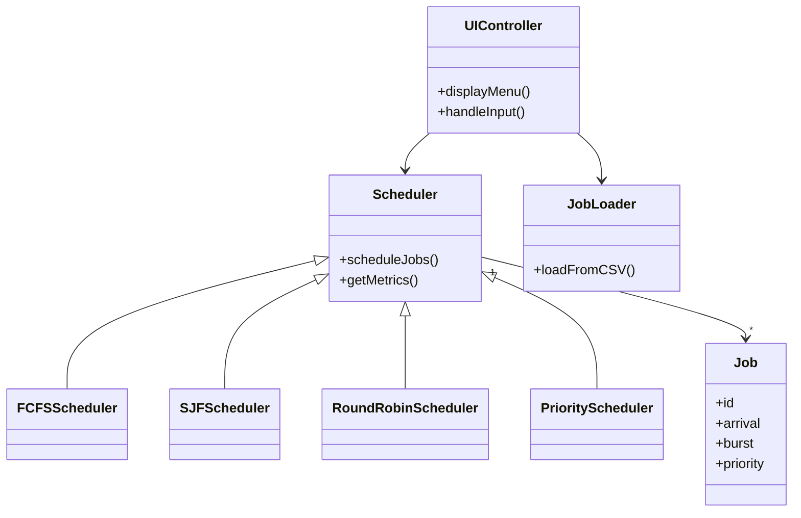
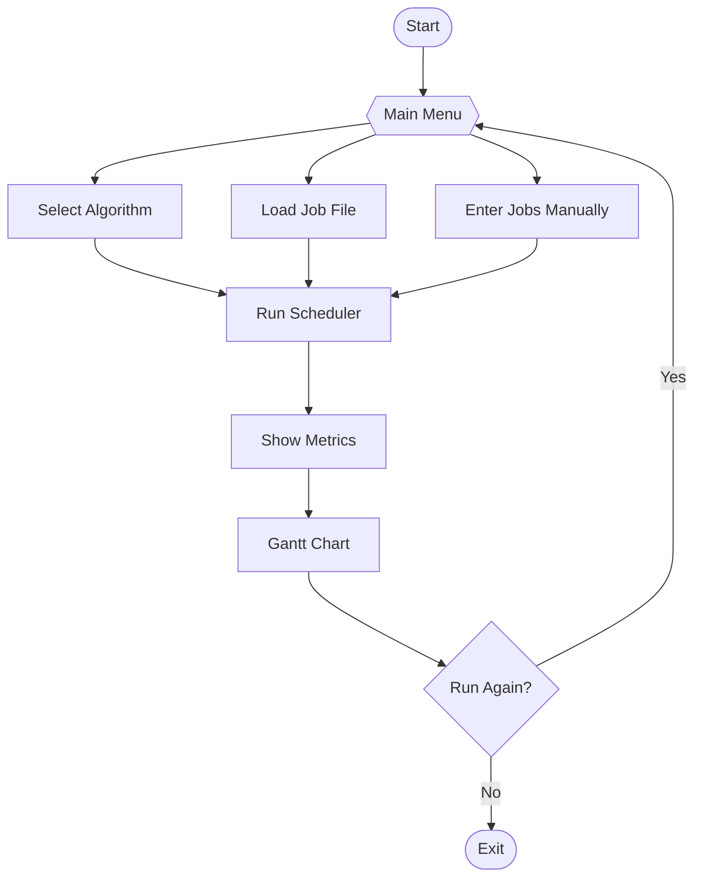

# Advanced C++ Job Scheduler

## Project Overview

`AdvancedJobScheduler.cpp` is a single-file, modular C++ application simulating advanced CPU job scheduling algorithms. It features a robust CLI menu, dynamic job management, and a clear separation of concerns via classes such as `Scheduler`, `Job`, and `UIController`.

### Key Features

- **Multiple Scheduling Algorithms:** FCFS, SJF (Preemptive), Round Robin, Priority (Preemptive with aging).
- **Interactive CLI Menu:** Select algorithms, load job files, view results, and navigate options.
- **Dynamic Job Management:** Add, edit, and remove jobs at runtime.
- **Performance Metrics:** Average Turnaround Time, Average Waiting Time, and Gantt chart visualization.
- **Extensible Design:** Easily add new algorithms by extending the `Scheduler` class.
- **Single-File Simplicity:** All logic contained in `AdvancedJobScheduler.cpp` for easy compilation and portability.

---

## Usage Instructions

### Compile

```sh
g++ -std=c++17 AdvancedJobScheduler.cpp -o AdvancedJobScheduler
```

### Run

```sh
./AdvancedJobScheduler
```

- Follow the interactive CLI/menu prompts to select scheduling algorithms, load job data, and view results.
- Job data can be loaded from a CSV file (see example below) or entered manually via the menu.

---

## Example Job File (`jobs.csv`)

```csv
id,arrival,burst,priority
1,0,5,2
2,2,3,1
3,4,1,3
4,6,2,2
```

---

## Class Diagram



---

## CLI/Menu Flowchart



---

## Extending

To add new scheduling algorithms, extend the `Scheduler` class and update the CLI menu logic in `UIController`.

---

## License

MIT

---

## Legacy Project Structure (for reference)

```text
Scheduler/
├── src/
│   ├── Job.cpp
│   ├── FCFSScheduler.cpp
│   ├── SJFScheduler.cpp
│   ├── RoundRobinScheduler.cpp
│   ├── PriorityScheduler.cpp
│   ├── Simulator.cpp
│   └── main.cpp
├── include/
│   ├── Job.h
│   ├── Scheduler.h
│   ├── FCFSScheduler.h
│   ├── SJFScheduler.h
│   ├── RoundRobinScheduler.h
│   ├── PriorityScheduler.h
│   ├── Simulator.h
├── data/
│   └── jobs.csv
├── README.md